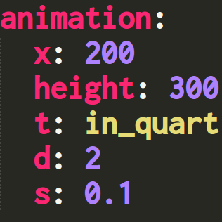

# AnimationBuilder: Easy way of writing Kivy Animations

Using `kivy.animation.Animation` directly is kinda pain. `AnimationBuilder` allows you to write animations in YAML format.



## Usage

The following code:

```python
from kivy.garden.animationbuilder import AnimationBuilder

anims = AnimationBuilder.load_string(r'''
move_to_right:
  right: 800
  d: 2
move_to_top:
  top: 600
  t: in_out_cubic
''')

anims['move_to_right'].start(some_widget1)
anims['move_to_top'].start(some_widget2)
```

is equivalent to:

```python
from kivy.animation import Animation

Animation(right=800, d=2).start(some_widget1)
Animation(top=600, t='in_out_cubic').start(some_widget2)
```

The former looks even worse than the latter, but when you write more complex animations, the latter may become unreadable.  

### Sequential Animation

```yaml
test_sequence:
  sequence:  # You can write 'S' instead of 'sequence'
    - right: 800
      d: 2
    - top: 600
      t: in_out_cubic
```

You can use other animations inside.

```yaml
move_to_right:
  right: 800
  d: 2
test_sequence:
  S:
    - move_to_right
    - top: 600
      t: in_out_cubic
```

### Parallel Animation

```yaml
move_to_right:
  right: 800
  d: 2
test_parallel:
  parallel:   # You can write 'P' instead of 'parallel'
    - move_to_right
    - top: 600
      t: in_out_cubic
```

### Nest as you like

```yaml
more_nesting:
  P:
    - S:
        - opacity: 0
          d: 0.3
          t: in_out_quad
        - opacity: 1
          d: 0.3
          t: in_out_quad
      repeat: True
    - S:
        - right: 800
        - top: 600
        - x: 0
        - y: 0
        - d: 1
      repeat: True
```

But the following code might be easier to read.

```yaml
less_nesting:
  P:
    - move_rectangulary
    - blinking

blinking:
  S:
    - opacity: 0
      d: 0.3
      t: in_out_quad
    - opacity: 1
      d: 0.3
      t: in_out_quad
  repeat: True

move_rectangulary:
  S:
    - right: 800
    - top: 600
    - x: 0
    - y: 0
    - d: 1
  repeat: True
```

### eval

You can use python expression.  

```python
from random import random
from kivy.utils import get_random_color

from kivy.garden.animationbuilder import AnimationBuilder


anims = AnimationBuilder.load_string(r'''
change_color:
    color: get_random_color()
    d: random() + additional_time
''')
anims.locals.update(
    get_random_color=get_random_color,
    random=random,
    additional_time=1,
)

anim = anims['change_color']  # This is where `eval()` is called.
anim.start(some_widget)
```

`eval()` is called when an animation is created. And `locals` and `globals` properties are passed to it.

### \_\_init\_\_

If the YAML file contains `__init__` as a key of dictionary, its value will be excuted as python statements. The following code is equivalent to the above:

```python
from kivy.garden.animationbuilder import AnimationBuilder

anims = AnimationBuilder.load_string(r'''
__init__: |
    from random import random
    from kivy.utils import get_random_color
    additional_time = 1

change_color:
    color: get_random_color()
    d: random() + additional_time
''')

anim = anims['change_color']
anim.start(some_widget)
```

## Live Preview

Just like [kviewer](https://github.com/kivy/kivy/blob/master/kivy/tools/kviewer.py), `livepreview.py` allowing you to dynamically display the animation.

```text
python -m kivy_garden.animationbuilder.livepreview ./filename.yaml
```

  


## Requirements

- pyyaml
- watchdog (optional, only needed by livepreview.py)

## Notes

### Everytime you call `__getitem__()`, it returns a new instance

So `anims['key'] is anims['key']` is always False.  

### Be careful of using some words (YAML in general)

There are so many words that are translated as boolean value.  
For instance: Yes, No, y, n, ON, OFF  [more info](http://yaml.org/type/bool.html)

### Circular reference may crash the program(not tested)

```yaml
anim1:
  S:
    - anim2
anim2:
  S:
    - anim1
```

## Others

**Tested Environment**  

- Python 3.7.1 
- Kivy(`pip install git+git://github.com/matham/kivy.git@async-support#egg=kivy`)
