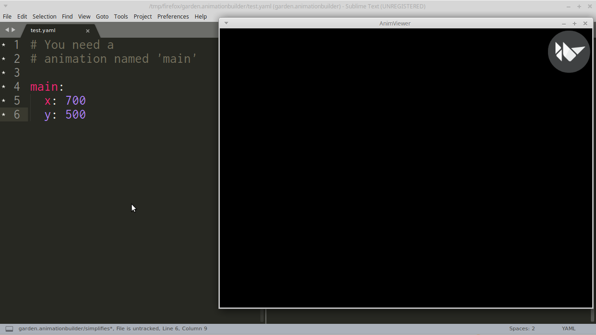

# AnimationBuilder: Easy way of writing Kivy Animations

Using kivy.animation.Animation directly is a pain. AnimationBuilder provides you with easy way.  


## Usage

### Basic

```python
from kivy.garden.animationbuilder import AnimationBuilder


anims = AnimationBuilder.load_string(r'''
move_to_right:
  right: 800
  d: 2
move_to_top:
  top: 600
  t: in_out_cubic
''')

anims['move_to_right'].start(some_widget1)
anims['move_to_top'].start(some_widget2)
```

The code above is equivalent to  

```python
from kivy.animation import Animation

Animation(right=800, d=2).start(some_widget1)
Animation(top=600, t='in_out_cubic').start(some_widget2)
```

The former looks even worse than the latter. But when you write more complex animations, the latter becomes unreadable.  

### Sequential Animation

```yaml
test_sequential:
  sequential:  # You can use 'S' instead of 'sequential'
    - right: 800
      d: 2
    - top: 600
      t: in_out_cubic
```

You can use other animations inside.

```yaml
move_to_right:
  right: 800
  d: 2
test_sequential:
  S:
    - move_to_right
    - top: 600
      t: in_out_cubic
```

### Parallel Animation

```yaml
move_to_right:
  right: 800
  d: 2
test_parallel:
  parallel:   # You can use 'P' instead of 'parallel'
    - move_to_right
    - top: 600
      t: in_out_cubic
```

### Nest as you like

```yaml
more_nesting:
  P:
    - S:
        - opacity: 0
          d: 0.3
          t: in_out_quad
        - opacity: 1
          d: 0.3
          t: in_out_quad
      repeat: True
    - S:
        - right: 800
        - top: 600
        - x: 0
        - y: 0
        - d: 1
      repeat: True
```

But the code below might be easier to read.  

```yaml
less_nesting:
  P:
    - move_rectangulary
    - blinking

blinking:
  S:
    - opacity: 0
      d: 0.3
      t: in_out_quad
    - opacity: 1
      d: 0.3
      t: in_out_quad
  repeat: True

move_rectangulary:
  S:
    - right: 800
    - top: 600
    - x: 0
    - y: 0
    - d: 1
  repeat: True
```

### eval

You can use python expression.  

```python
from random import random
from kivy.utils import get_random_color

from kivy.garden.animationbuilder import AnimationBuilder


anims = AnimationBuilder.load_string(r'''
change_color:
    color: "eval: get_random_color()"
    d: "eval: random() + additional_time"
''')
anims.locals = {
    'get_random_color': get_random_color,
    'random': random,
}
anims.globals = {'additional_time': 1, }

anims['change_color'].start(some_widget)
```

'locals' and 'globals' attributes are directly passed to build-in function 'eval()'.  

### locals & globals

You can access to the 'locals' directly.  

```python
from kivy.utils import get_random_color

from kivy.garden.animationbuilder import AnimationBuilder


anims = AnimationBuilder.load_string(r'''
change_color:
    color: "locals: external_value"
''')
anims.locals = {'external_value': get_random_color(), }

anims['change_color'].start(some_widget)
```

Same for 'globals'.  

## Live Preview

Just like [kviewer](https://github.com/kivy/kivy/blob/master/kivy/tools/kviewer.py), livepreview.py allowing you to dynamically display the animation.

```text
python3 ./livepreview.py filename.yaml
```

  


## Requirements

- pyyaml
- watchdog (optional, only needed by livepreview.py)

## Notes

### Everytime you call \_\_getitem\_\_(), it create a new instance

so  `anims['key'] is anims['key']` is always False.  

### Be careful of using some words (YAML in general)

There are so many words that are translated as boolean value.  
For instance: Yes, No, y, n, ON, OFF  [more info](http://yaml.org/type/bool.html)

## Others

[Youtube](https://www.youtube.com/playlist?list=PLNdhqAjzeEGiF1oLISnCCPoPj1FhZbOAP)  

**Tested Environment**  
Python 3.5.0 + Kivy 1.10.0  
Python 2.7.2 + Kivy 1.10.0  
